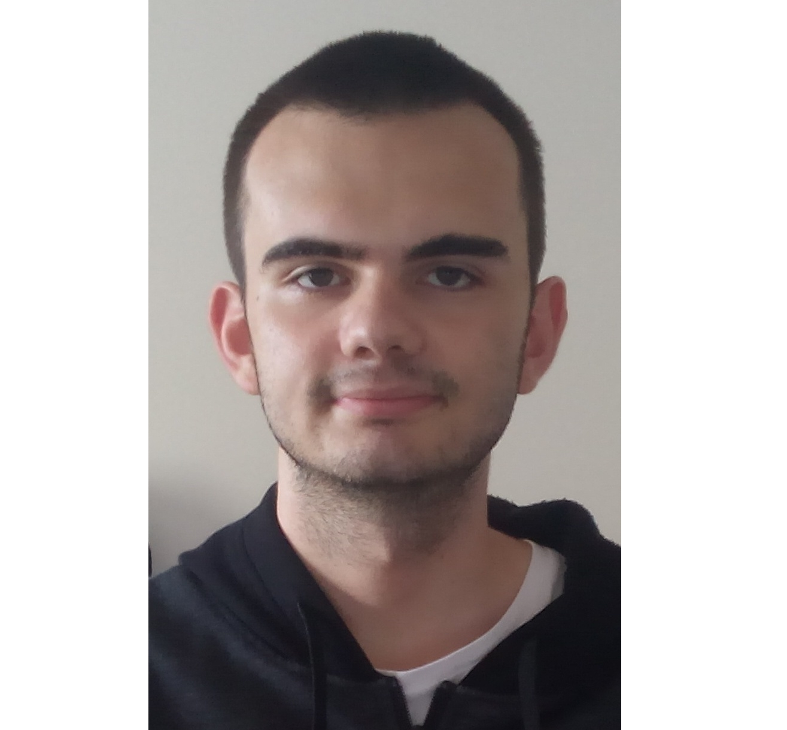

# Activity

## What I do and what I've done in the past & my education

> ## Education

__Transylvania__ is my home county, so I studied there for 12 years.

I finished my studies at C.N.E.R, the __3rd most credited school nationally__.

During my final years, I've a bunch of activities, such as:

1. __1st Prize NASA 2017__ 10th grade individual
2. __1st Prize at INfoEducatie__, a Google & Cisco sponsored national contest (I won by making the __1st Linux Launchpad__), called [Mb Launchpad](https://github.com/MusicBoard-Linux-Launchpad). In the final round of the contest, I made a basic programming language (sort of), with a collague: visit [LFO](https://github.com/LfoProgramming)

